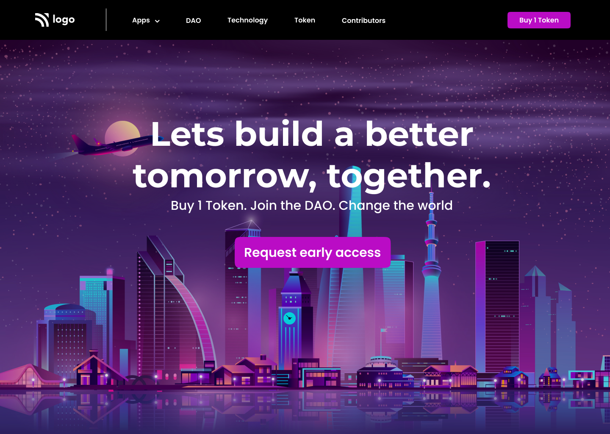

# Project 5

## Project 5 [Live Link](https://zeeshan-html-css-project-5.netlify.app)

-   Skills Gained in this project
    -   Learned to use flex direction
    -   learn to give background colour on navigation bar 

## Time taken to finish this project

-   3 hour taken to complete it.

# Preview

